# Report on Bot Performance

In our game, we have four different bots, each written with different algorithms:
* **Random Bot** - makes random moves.
* **MCS Bot** - uses a Minimax algorithm with depth 1, and many random simulations as a heuristic evaluation function (besed on monte carlo simulation)
* **Minimax Bot** - employs alpha-beta pruning optimization.
* **MCTS Bot** - basic implementation using random simulations as a heuristic evaluation function.

We have three different variants for the MCS, Minimax, and MCTS bots: easy, medium, and hard. We performed battles between each bot and below are results of their perfomance.

---

### MCS Bot

##### Overall Performance:
| Easy Bot | Medium Bot | Hard Bot | 
| --- | --- | --- | 
| 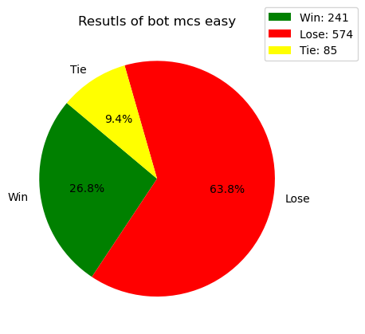 | 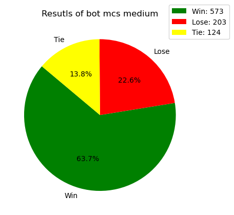 | 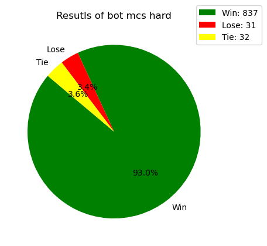 |

##### Performance Between MCT Bots:
| Easy vs Random | Medium vs Easy | Hard vs Medium |
| --- | --- | ---|
| 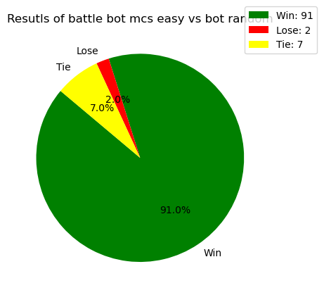 |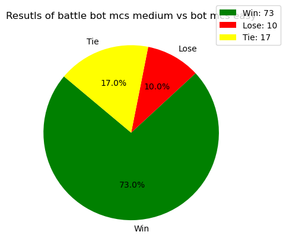 | 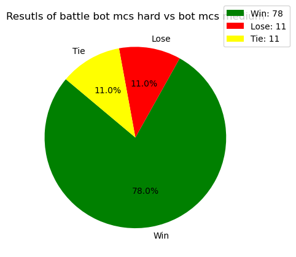 |

---

### Minimax Bot

##### Overall Performance:
| Easy Bot | Medium Bot | Hard Bot | 
| --- | --- | --- | 
| 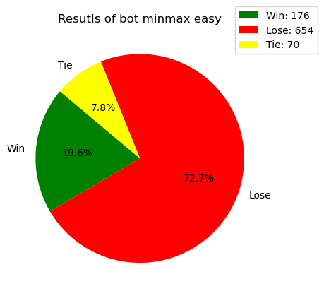 | 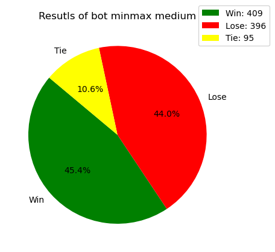 | 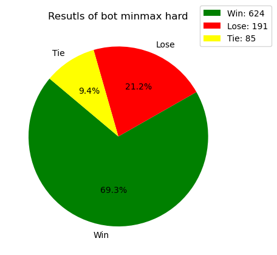 |

##### Performance Between Minimax Bots:
| Easy vs Random | Medium vs Easy | Hard vs Medium |
| --- | --- | ---|
| 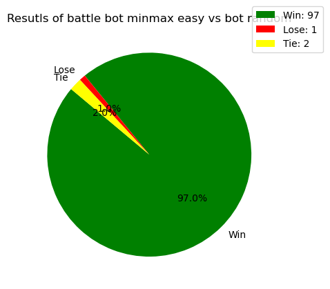 |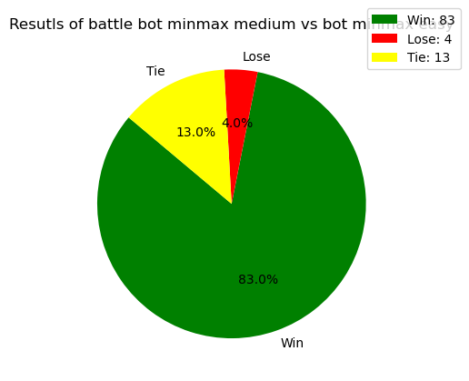 | 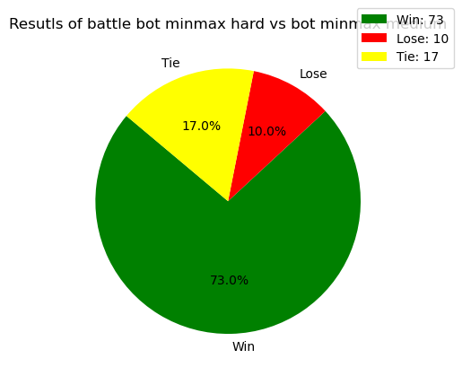 |

---

### MCTS Bot

##### Overall Performance:
| Easy Bot | Medium Bot | Hard Bot | 
| --- | --- | --- | 
| 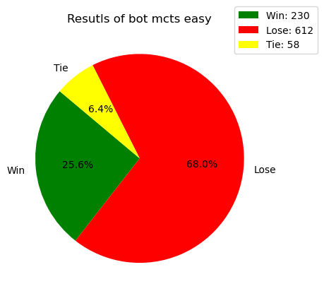 | 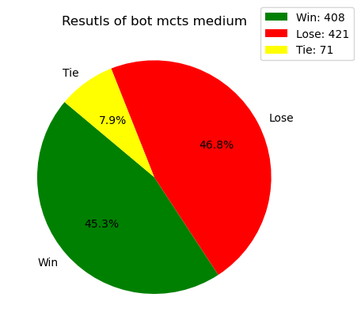 | 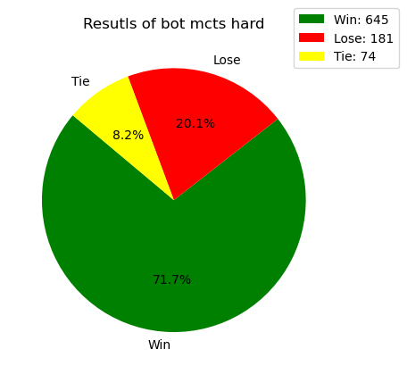 |

##### Performance Between MCTS Bots:
| Easy vs Random | Medium vs Easy | Hard vs Medium |
| --- | --- | ---|
| 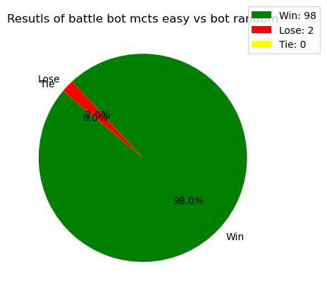 |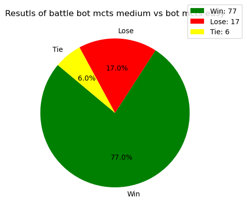 | 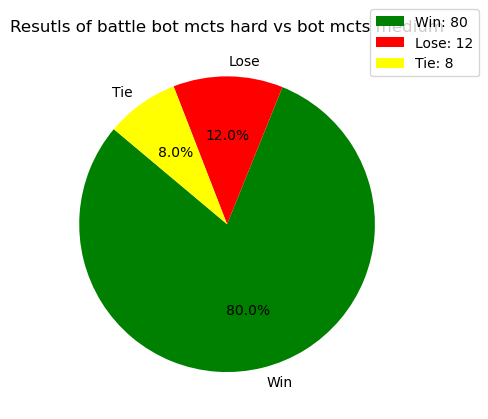 |

---

### Ranking of Bot Performance 

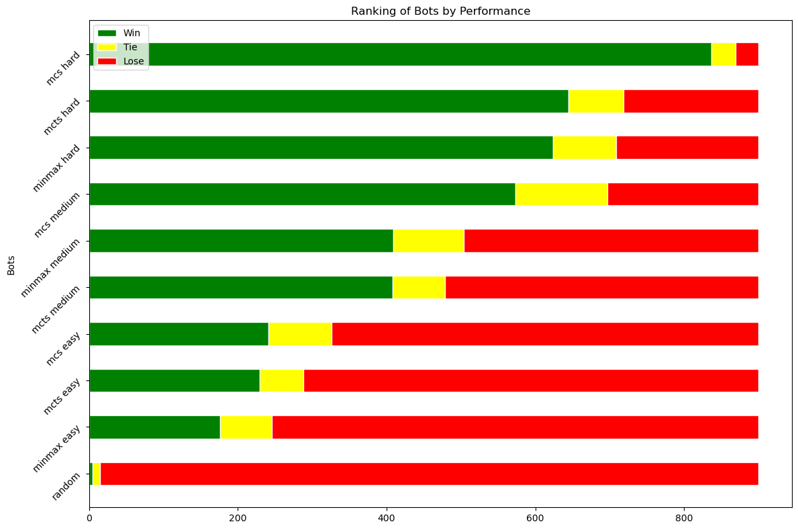

---

### More accurate stats of battle between bots

| heatmap of wins | heatmap of loses | heatmap of ties| 
| --- | --- | --- | 
| 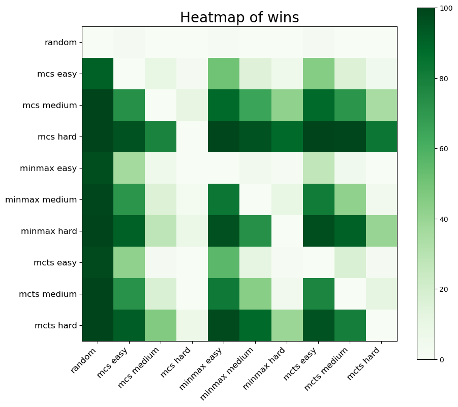 | 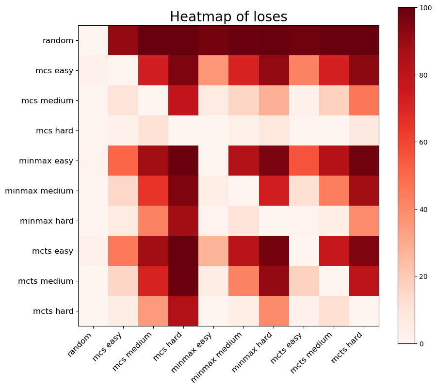 | 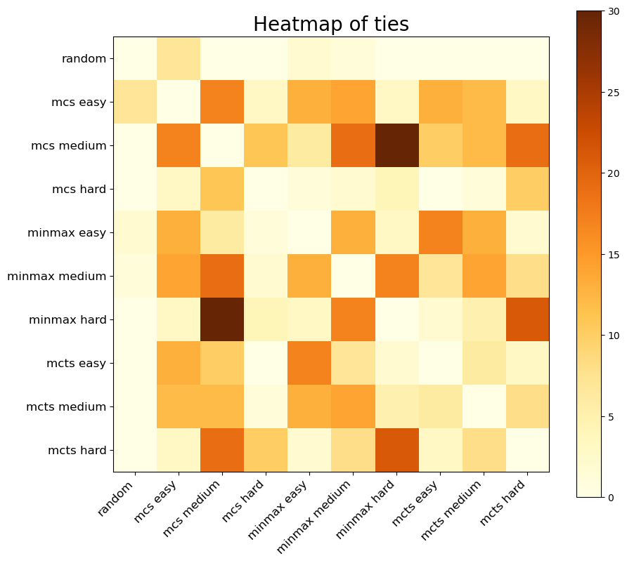 |

---

### Conclusions

As we see, even the easy bots easily beat the random bot.\
Approximately, increasing the bot's level makes it 10 times harder to beat.\
The best algorithm for Super Tic Tac Toe is MCS.